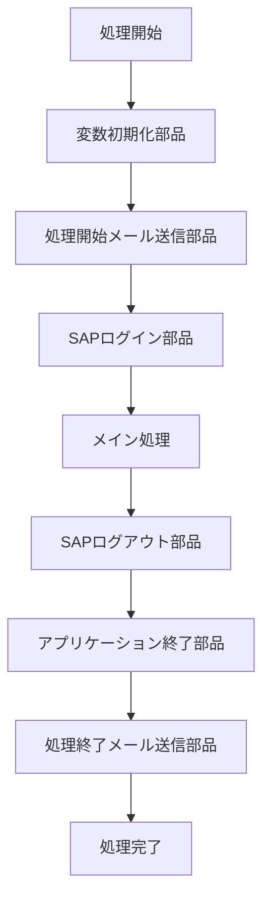
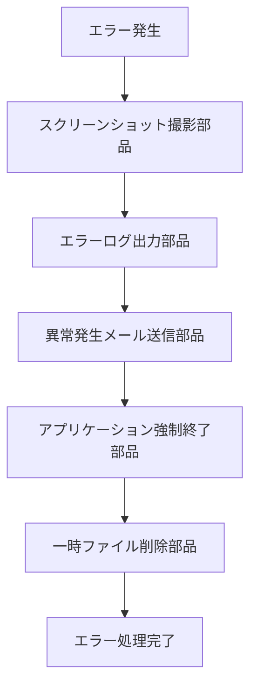

# 共通部品の考え方と作り方

## 共通部品とは？

**共通部品**とは、様々なロボットで再利用できる汎用的な処理を、メインのロボットから分離し、独立させたものです。

### 身近な例で理解しよう
料理に例えると、「玉ねぎのみじん切り」や「だしを取る」といった基本的な工程を、毎回レシピに詳しく書かずに「共通の調理法」として別にまとめておくようなものです。

### システム面での仕組み
- **モジュール化**：大きなプログラムを小さな部品に分ける手法
- **部品化**：よく使う処理を独立したファイルとして保存
- **呼び出し**：メインのロボットから必要な時に共通部品を実行

---

## 共通部品を作るメリット

### 1. ロボットの製作期間の短縮 ⏰
**既に作った部品を再利用できるため、開発が早くなります**

#### 例：ログイン処理の場合
```
❌ 共通部品なし
├── ロボットA：ログイン処理を1から作成（2時間）
├── ロボットB：ログイン処理を1から作成（2時間）
└── ロボットC：ログイン処理を1から作成（2時間）
合計：6時間

✅ 共通部品あり
├── 共通ログイン部品：初回作成（3時間）
├── ロボットA：共通部品を呼び出し（10分）
├── ロボットB：共通部品を呼び出し（10分）
└── ロボットC：共通部品を呼び出し（10分）
合計：3時間30分
```

### 2. メンテナンス性の向上 🔧
**修正が1箇所で済み、全体に反映されます**

#### システム面での仕組み
- **一箇所修正**：共通部品のファイルだけを修正
- **自動反映**：その部品を使っている全てのロボットに変更が適用
- **バージョン管理**：共通部品の変更履歴を一元管理

#### 例：エラー時のスクリーンショット機能
```
修正前：スクリーンショットをデスクトップに保存
修正後：スクリーンショットを専用フォルダに保存

→ 共通部品を1回修正するだけで、
  この機能を使う10個のロボット全てに反映される
```

### 3. エラー箇所の特定、可読性の向上 🔍
**処理が整理され、問題の原因を見つけやすくなります**

---

## 共通部品を作るデメリット

### 1. 改修の影響が全体に及ぶリスク ⚠️
**共通部品の修正ミスが、全てのロボットに影響します**

#### 対策：設計をしっかり固める
- **テスト環境**での十分な検証
- **影響範囲の確認**：どのロボットが使用しているかリスト化
- **段階的リリース**：一部のロボットで先行テスト

### 2. 分割しすぎによる複雑化 🧩
**細かく分けすぎると、全体の流れが分からなくなります**

#### 対策：一定のルールを設ける
- **適切な粒度**：1つの部品は1つの役割に集中
- **命名規則**：部品の機能が分かりやすい名前をつける
- **ドキュメント化**：部品の役割と使い方を記録

---

## 共通部品化の判断基準

### 1. 他のロボットで流用する可能性が高い処理 🔄

#### 具体例
- **システムログイン/ログアウト**
  ```
  SAP、Salesforce、社内システムなど
  → 多くのロボットで必要
  ```
- **ファイル操作**
  ```
  コピー、削除、リネームなど
  → 頻繁に使用される基本操作
  ```

### 2. 同じ処理を複数回繰り返している処理 🔁

#### 例：Excel操作
```
❌ 繰り返し記述
1. Excelファイルを開く → ウィンドウ最大化
2. 別のExcelファイルを開く → ウィンドウ最大化  
3. また別のExcelファイルを開く → ウィンドウ最大化

✅ 共通部品化
「Excelファイルを開いて最大化」という部品を作成
→ 必要な時に呼び出すだけ
```

### 3. 単一の役割を持つ処理 🎯
**1つの部品は1つの仕事だけを行う**

---

## 共通部品化すべき処理例

### 1. ロボット起動時・終了時の処理 🚀

#### 起動時の共通処理例
```markdown
- 変数の初期化
- 使用アプリケーションの事前クローズ
- 稼働開始通知メール送信
- 一時ファイルの削除
- 作業フォルダの作成
```

#### 終了時の共通処理例
```markdown
- 使用アプリケーションの終了
- 一時ファイルのクリーンアップ
- 稼働終了通知メール送信
- ログファイルの保存
```

### 2. システムへのログイン・ログアウト処理 🔐

#### 例：SAPログイン部品
```
入力：ユーザーID、パスワード、サーバー情報
処理：
1. SAPを起動
2. ログイン情報を入力
3. ログイン成功を確認
4. 必要な画面まで遷移
出力：ログイン成功/失敗の結果
```

### 3. データのアップロード・ダウンロード処理 📁

#### 例：SharePointファイル操作部品
```
機能別に部品を作成：
- ファイルダウンロード部品
- ファイルアップロード部品  
- フォルダ作成部品
- ファイル削除部品
```

### 4. ログ出力処理 📝

#### システム面での仕組み
- **ログレベル**：INFO、WARNING、ERRORなどの重要度設定
- **ファイル出力**：決められた場所にログファイルを保存
- **フォーマット統一**：日時、処理名、メッセージの形式を統一

#### 例：ログ出力部品
```
入力：メッセージ、ログレベル
処理：
1. 現在時刻を取得
2. 決められた形式でメッセージを整形
3. ログファイルに追記保存
出力：ログ出力完了通知
```

---

## 共通部品作成事例

### 事例1：通常処理での活用 ✅



### 事例2：エラー発生時の処理 ❌



---

